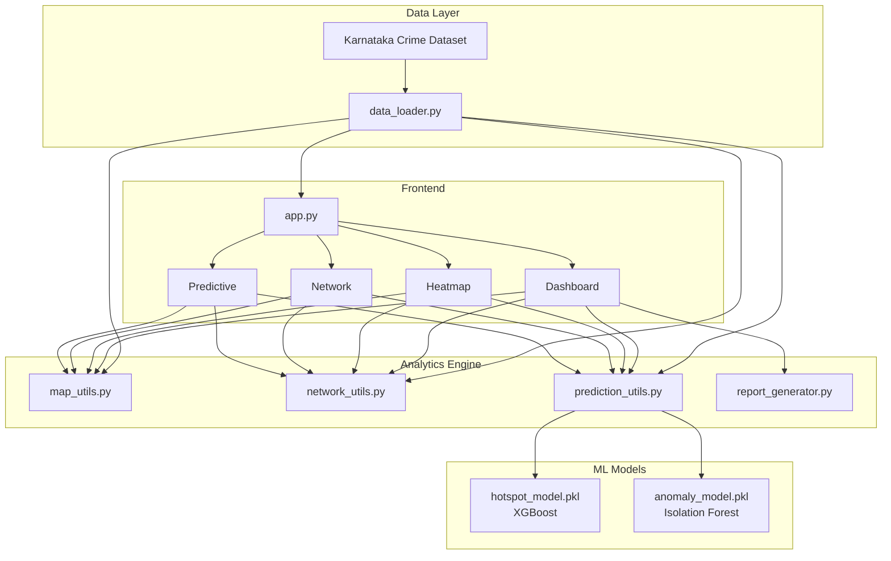

# CrimeLens AI

**AI-Powered Crime Intelligence & Predictive Policing Platform for Karnataka State Police**

CrimeLens AI transforms disconnected crime records into actionable intelligence using visualization, geospatial analytics, network analysis, and machine learning.


---

## Project Overview

Current crime records exist in disconnected silos. Investigators rely on Excel sheets with no predictive analysis or network-based criminal association analysis.

**CrimeLens AI** helps Karnataka State Police move from **reactive policing** to **proactive intelligence-led policing**.

---

## Features

| Module | Description |
|--------|-------------|
| 📊 **Dashboard** | Real-time KPIs, crime trends, arrest rates, repeat offender analytics, PDF reports |
| 🗺️ **Crime Heatmap** | Interactive Folium map with markers, heatmap, and hotspot clusters |
| 🔗 **Network Analysis** | Criminal association graphs with community detection and centrality scoring |
| 📈 **Predictive Analytics** | XGBoost hotspot prediction, Isolation Forest anomaly detection, risk forecasting |

---

## Architecture



---

## Project Structure

```
CrimeLens-AI/
├── app.py                          # Main entry point
├── data/
│   └── Karnataka_CrimeLens_Synthetic_Dataset.csv
├── pages/
│   ├── 1_Dashboard.py
│   ├── 2_Crime_Heatmap.py
│   ├── 3_Network_Analysis.py
│   └── 4_Predictive_Analytics.py
├── utils/
│   ├── data_loader.py
│   ├── map_utils.py
│   ├── network_utils.py
│   ├── prediction_utils.py
│   ├── report_generator.py
│   └── theme.py
├── models/
│   ├── hotspot_model.pkl
│   └── anomaly_model.pkl
├── assets/
│   └── logo.png
├── scripts/
│   └── setup_data.py
├── requirements.txt
├── Dockerfile
└── README.md
```

---

## Installation

### Prerequisites

- Python 3.11 or higher
- pip package manager
- **macOS:** For native XGBoost support, run `brew install libomp` (app falls back to scikit-learn GradientBoosting otherwise)

### Setup

```bash
# Clone or navigate to project directory
cd CrimeLens-AI

# Create virtual environment
python3 -m venv venv
source venv/bin/activate  # On Windows: venv\Scripts\activate

# Install dependencies
pip install -r requirements.txt

# Generate dataset and train ML models
python scripts/setup_data.py
```

---

## Running Locally

```bash
# One-command launch
streamlit run app.py
```

Open [http://localhost:8501](http://localhost:8501) in your browser.

---

## Docker Deployment

```bash
# Build image
docker build -t crimelens-ai .

# Run container
docker run -p 8501:8501 crimelens-ai
```

Access at [http://localhost:8501](http://localhost:8501)

---

## Zoho Catalyst Deployment

1. Create a new **Catalyst Serverless Function** or **AppSail** service
2. Upload the project or connect via Git
3. Configure build command: `pip install -r requirements.txt && python scripts/setup_data.py`
4. Set start command: `streamlit run app.py --server.port=9000 --server.address=0.0.0.0`
5. Expose port 9000 (Catalyst default)

---

## Screenshots

> Add screenshots after running the application:

| Dashboard | Crime Heatmap |
|-----------|---------------|
| *Screenshot placeholder* | *Screenshot placeholder* |

| Network Analysis | Predictive Analytics |
|------------------|---------------------|
| *Screenshot placeholder* | *Screenshot placeholder* |

---

## ML Models

### Model 1: Hotspot Prediction (XGBoost)
- **Target:** High Risk Zone classification
- **Features:** District, Crime Type, Population Density, Unemployment Rate, Repeat Offender
- **Output:** Low / Medium / High Risk

### Model 2: Anomaly Detection (Isolation Forest)
- Detects unusual crime spikes and emerging trends
- Monitors district-monthly crime patterns

### Model 3: Risk Forecasting
- Weighted scoring model for next-month district risk rankings
- Factors: crime volume, repeat offender rate, unemployment, recent activity

---

## Future Scope

- [ ] Real-time FIR integration with state police databases
- [ ] Facial recognition and CCTV feed analysis
- [ ] Mobile app for field officers
- [ ] Multi-state expansion beyond Karnataka
- [ ] Advanced deep learning models (LSTM for time-series forecasting)
- [ ] Automated alert system via SMS/email for anomaly detection
- [ ] Role-based access control for different police ranks
- [ ] Integration with CCTNS (Crime and Criminal Tracking Network & Systems)

---

## Tech Stack

| Category | Technology |
|----------|------------|
| Frontend | Streamlit |
| Visualization | Plotly, Folium, Streamlit-Folium |
| Machine Learning | Scikit-Learn, XGBoost |
| Network Analysis | NetworkX, PyVis |
| Data Processing | Pandas, NumPy |
| Reports | ReportLab (PDF) |
| Deployment | Docker, Zoho Catalyst |

---

## License

MIT License — Built for Karnataka State Police Hackathon Demo

---

**CrimeLens AI v1.0** | CONFIDENTIAL — For Official Use Only
